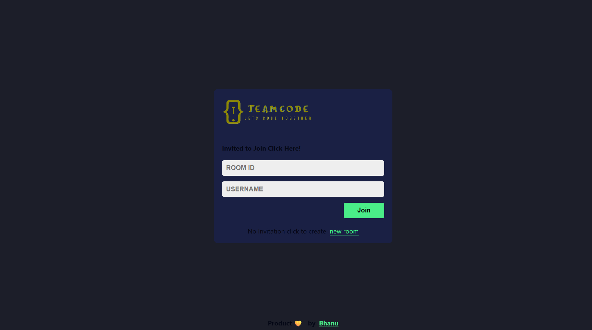
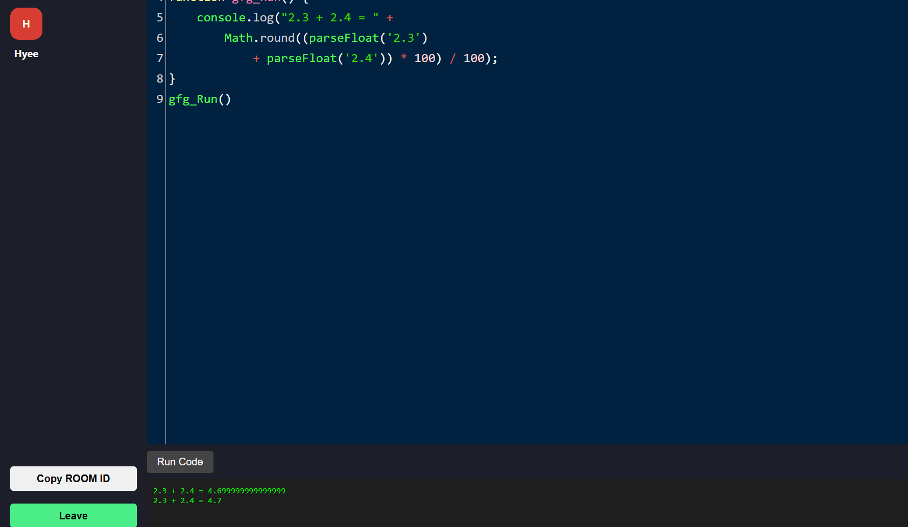

# TeamCode - Collaborative Code Editor 👨‍💻👩‍💻

TeamCode is a real-time collaborative JavaScript code editor that lets you share a room ID with friends and code together instantly. Built with **React** and **Socket.IO**, TeamCode enables seamless code synchronization without the need for a backend database — just share and join, and start coding!

---

## 🚀 Features

- 🧑‍🤝‍🧑 **Room-based collaboration**  
  Create a room and share the ID with others to start collaborating in real-time.

- 🔄 **Live Code Sync**  
  Code changes are instantly reflected for all users in the same room.

- 🛠️ **No Database Required**  
  All synchronization is handled via WebSockets. No data is persisted — perfect for quick sessions and hackathons.

- ⚡ **Simple UI**  
  Lightweight and intuitive user interface for quick collaboration.

---

## 📦 Tech Stack

- **Frontend:** React, HTML, CSS, JavaScript
- **Real-Time Sync:** Socket.IO
- **Editor:** CodeMirror / Monaco Editor (update based on what you're using)

---

## 📸 Screenshots

---

